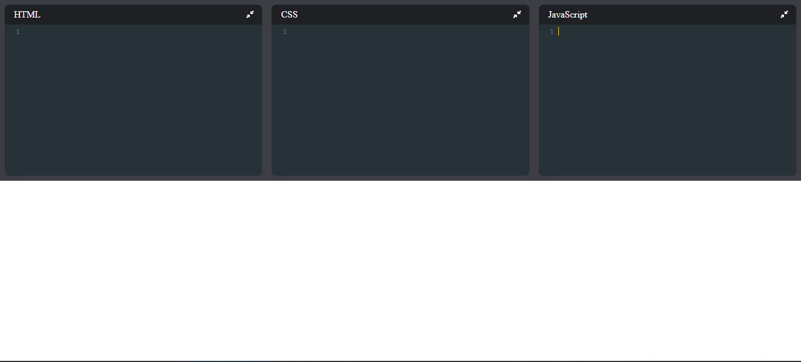
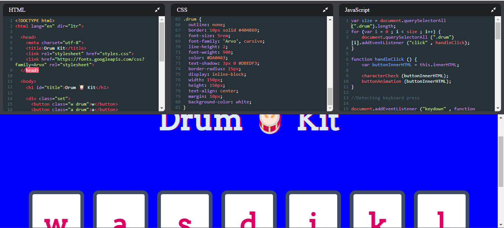

# CodeIt

# Overview
### CodeIt is a software tool that helps developers write and edit source code. It provides a user-friendly interface where developers can type in their code and perform various coding-related tasks and see the output for their provided code in HTML, CSS and JavaScript. CodeIt is designed to enhance the coding experience by providing features such as syntax highlighting, code completion, error checking, and debugging capabilities.

### Here are some key features and functionalities of CodeIt:

### 1. Syntax Highlighting: CodeIt colorize different elements of the code to improve readability. This feature helps developers quickly identify variables, keywords, comments, and other parts of the code.

### 2. Code Autocompletion: CodeIt often provide intelligent suggestions and auto-completion for code snippets, function names, variable names, and other elements. This helps reduce typos and speeds up coding by providing suggestions based on context.

### 3. Code Formatting: CodeIt can automatically format the code according to predefined rules or coding standards. This ensures consistent and clean code formatting.

### 4. Error Checking: CodeIt can analyze the code in real-time and highlight syntax errors, missing brackets, undefined variables, and other issues. This helps catch mistakes and improves code quality.

### 5. Code Navigation: CodeIt usually offer features to navigate through code files, such as a file explorer, search functionality, and jump-to-definition capabilities. These features help developers quickly navigate to different parts of their codebase.

### 6. Debugging Support: CodeIt come with integrated debugging capabilities or can be extended with debugging plugins. This allows developers to set breakpoints, inspect variables, and step through their code to identify and fix issues.

### 7. Version Control Integration: CodeIt often integrate with version control systems like Git, allowing developers to perform common version control operations directly within the editor. This includes features like committing changes, branching, merging, and resolving conflicts.

### CodeIt can be standalone applications or part of an integrated development environment (IDE). IDEs typically include additional tools and features like a built-in compiler, project management, and deployment capabilities, whereas code editors focus primarily on the code editing experience.

# Technical Specifications
### Website - https://bit.ly/CodeIt-app

### Languages- HTML, CSS, Javascript

### Frameworks- Node.js, React.js

# Complete Website Framework

## Before execution of any code

## After execution of any code

